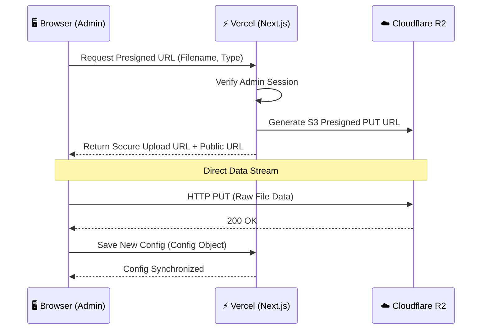

# ☁️  Cloudflare R2 Asset Management System

This document outlines the high-performance asset storage architecture implemented for **example.com**, migrating from Supabase Storage to Cloudflare R2 for better latency, cost-efficiency, and edge delivery.

---

## 🏗️ Architecture Overview

The system uses a **Hybrid Edge-Auth Flow**. Authentication is handled on the server, while the actual data transfer happens directly between the Client and Cloudflare's Edge, bypassing Vercel's serverless function limitations.

---

## 🚀 Key Features

### 1. Direct-to-Cloud Uploads
The admin requests a short-lived S3 presigned PUT URL after server-side admin authorization and file type/size checks. The browser sends the file directly to R2, avoiding application-server request-body limits. The upload size limits are enforced before issuing the URL: images up to 10 MB, audio up to 25 MB, and video up to 100 MB.

### 2. Intelligent Folder Hierarchy
Assets are automatically routed to global edge CDN paths:
- **Images**: `/i/` mapped to `cdn.example.com`
- **Videos/Audio**: `/v/` mapped to `cdn.example.com`

### 3. Safe Asset Replacement
When a user replaces or removes an asset in `/me/admin`, the old object stays available until the updated profile config is saved. After the save succeeds, the admin attempts to delete unreferenced R2 objects. Failed cleanup remains queued and can be retried by saving again.

### 4. Gallery Removal
Removing a gallery item edits the pending profile draft. The R2 object is deleted only after that draft is saved successfully.

---

## 🛠️ Technical Fixes & Optimizations

### 🛂 CORS Configuration
To allow the browser to talk to Cloudflare, the following CORS policy is applied:
- **Allowed Origins**: `https://example.com`, `https://example.com`, `http://localhost:3000`
- Apply the policy in `cloudflare/r2-cors.json` to the R2 bucket before testing direct uploads.
- **Allowed Methods**: `GET, HEAD, PUT`
- **Allowed Headers**: `Content-Type` (the browser upload signs and sends this header)

### ⚡ Performance Tuning
- **Region**: `auto` (Routes to the nearest Cloudflare data center).
- **TTL**: Presigned URLs are valid for **600 seconds** (10 minutes).
- **MIME**: The browser sends the file MIME type used when requesting the URL; unsupported or missing types are rejected by the server.
- **Storage credentials**: `R2_ENDPOINT`, `R2_ACCESS_KEY_ID`, `R2_SECRET_ACCESS_KEY`, and `R2_BUCKET_NAME` are server-only secrets. Configure the public CDN host variables separately.

---

## ⚙️ Environment Configuration

| Variable | Usage |
|--- |--- |
| `R2_ENDPOINT` | Cloudflare R2 S3 API Endpoint |
| `R2_ACCESS_KEY_ID` | API Access Key |
| `R2_SECRET_ACCESS_KEY` | API Secret Key |
| `NEXT_PUBLIC_R2_DOMAIN` | `https://cdn.example.com` |
| `NEXT_PUBLIC_R2_IMAGE_DOMAIN` | `https://cdn.example.com` |
| `NEXT_PUBLIC_R2_VIDEO_DOMAIN` | `https://cdn.example.com` |

---

*Last Refactored: March 3, 2026 by Vipin R*
